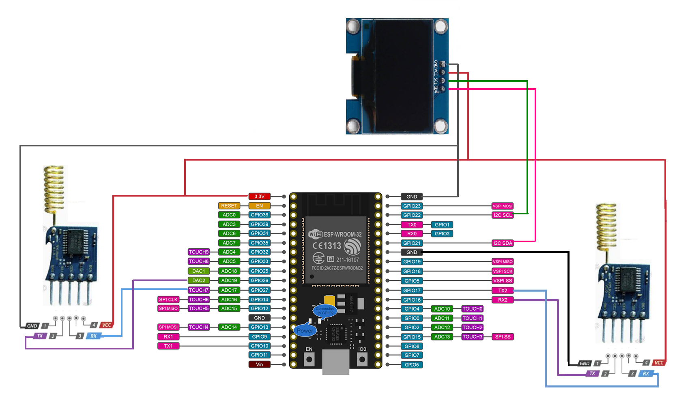

# Livestock Theft Prevention with IoT: Monitoring and Vital Signs Sensing System in Open Fields
This repository contains the firmware and code for the Central Unit of the Livestock Theft Prevention with IoT: Monitoring and Vital Signs Sensing System in Open Fields. The system is designed to detect potential livestock theft and monitor vital signs using IoT-enabled sensors and wireless communication.

## The Central Unit is responsible for:

* Receiving data from multiple IoT sensor nodes deployed on livestock.
* Processing incoming data to detect anomalies.
* Sending alerts via ethernet.
* Forwarding collected data for further analysis.

## Quick start
### Minimal setup
